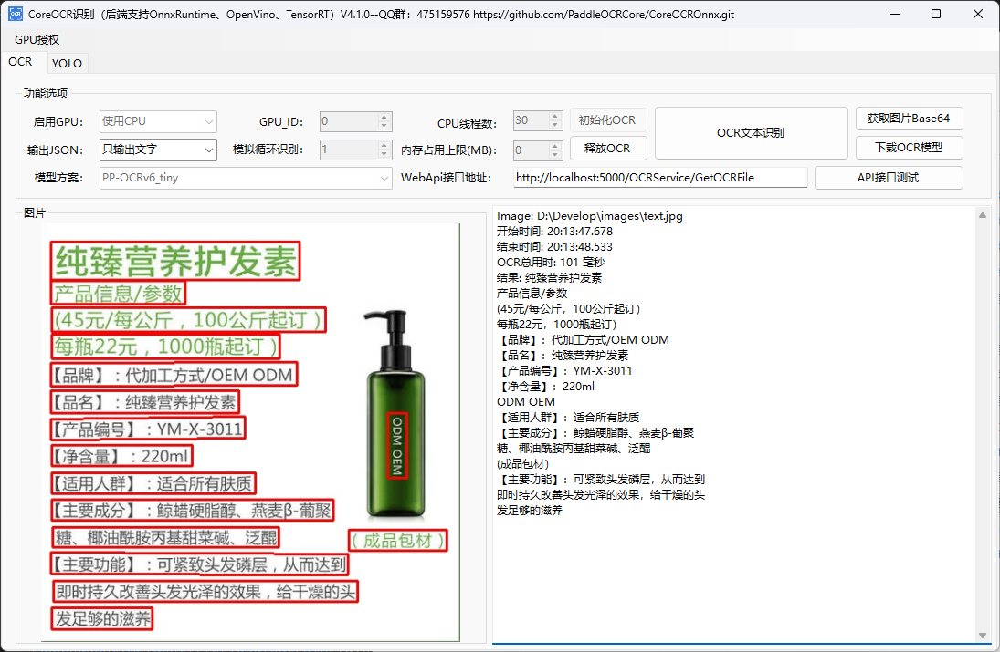

[](README.md) [](README_EN.md)
# CoreOCR Offline OCR Component with ONNX and YOLO Support for C#, C++, Java, Python, and Go

<p align="center">
    <a href="./LICENSE"></a>
    <a href="https://github.com/PaddleOCRCore/CoreOCROnnx/releases"></a>
    <a href="https://github.com/PaddleOCRCore/CoreOCROnnx/stargazers"></a>
</p>

## 1. Introduction

CoreOCR is a free, fast, offline OCR component. Choose one of three runtime backends: ONNX Runtime, OpenVINO, or TensorRT. Device support varies by backend: ONNX Runtime and OpenVINO packages can use the CPU or supported GPUs as described in their release notes, while the TensorRT package supports NVIDIA GPUs only. The component supports multithreaded concurrent development in C#, C++, Java, Python, and Go.

If you find this project useful, please give it a free Star.

Supports the latest PP-OCRv6 and PP-OCRv5 models and is backward compatible with V4 and V3 models.

For the Paddle Inference version, see [PaddleOCRCore/PaddleOCRApi](https://github.com/PaddleOCRCore/PaddleOCRApi).

YOLO models are also supported.

## 2. Runtime Environment

The project requires Visual Studio 2022 or later and .NET 10.0.

1. The core file, `PaddleOCROnnx.dll`, is a C++ dynamic-link library. Its CPU/GPU capabilities depend on the selected backend runtime package. The TensorRT package supports NVIDIA GPUs on Windows/Linux x64 only.

### Runtime Package Downloads

Download one of the following backend runtime packages from GitHub Releases:

- ONNX Runtime backend: [OCRRuntimeOnnx_v4.0.0.zip](https://github.com/PaddleOCRCore/CoreOCROnnx/releases/download/v4.0.0/OCRRuntimeOnnx_v4.0.0.zip)
- OpenVINO backend: [OCRRuntimeOpenVino_v4.0.0.zip](https://github.com/PaddleOCRCore/CoreOCROnnx/releases/download/v4.0.0/OCRRuntimeOpenVino_v4.0.0.zip)
- TensorRT backend: due to its size, download it from Baidu Netdisk: [CoreOCROnnxApi4.1-TensorRT.zip](https://pan.baidu.com/s/1h8tyeGzG0dukzMVDUwPqWQ?pwd=bejk)

Copy `PaddleOCROnnx.dll` and all dependencies from the same directory in the archive to the C# application output directory. The current release packages target Windows x64, so the C# project must also run as x64.

### [Web API Documentation](./CoreOCROnnx.WebApi/README.md)

After deployment, the Web API can be called by frontend applications.

### WinForms Demo Preview



## 3. Parameters

| Parameter | Default | Description |
| --------- | ------- | ----------- |
| det_model_dir | - | Path to the text detection inference model. |
| cls_model_dir | - | Path to the text direction classifier inference model. |
| rec_infer | - | Path to the text recognition inference model. |
| keys | - | Path to the text recognition dictionary. V5 and V4 dictionaries are not interchangeable. |
| General parameters | -- | -- |
| cpu_mem | 4000 | CPU memory limit in MB. Use `-1` for no limit. |
| cpu_math_library_num_threads | 10 | Number of CPU inference threads. More threads generally improve inference speed when sufficient CPU cores are available. |
| use_gpu | false | Whether to use a GPU. The TensorRT backend always uses a GPU; this parameter is retained only for ABI compatibility. |
| gpu_id | 0 | GPU ID. For TensorRT, this selects the CUDA device. |
| gpu_mem | 4000 | GPU memory parameter. Its actual meaning and availability depend on the selected backend. |
| padding | 20 | Adds a white border during image preprocessing to improve recognition. Increase this value when text boxes do not fully enclose the text. |
| maxSideLen | 1024 | Maximum length of the image's longest side. Use `0` to disable resizing. For example, a value of `1024` resizes images whose longest side exceeds 1024 pixels. |
| boxScoreThresh | 0.5 | Text-box confidence threshold. Lower this value when text boxes do not fully enclose the text. |
| boxThresh | 0.3 | Detection box threshold. Tune this value for your use case. |
| unClipRatio | 1.6 | Scale factor for individual text boxes. Larger values produce larger boxes. The ideal value depends on image dimensions and may need to be increased for larger images. |
| doAngle | true | Enable text direction detection only when images may be rotated by 90-270 degrees. |
| mostAngle | true | Enable (`1`) or disable (`0`) angle voting, which recognizes the whole image using the most probable text direction. This option has no effect when direction detection is disabled. |
| visualize | false | Visualize results. When `true`, annotated images are saved under the `output` directory using the input image names. |
| enable_log | false | Write logs to files under the `log` directory. |
| isOutputConsole | true | Write logs to the console. |

## 4. OpenVINO Backend

The C# Web API and WinForms applications call the CoreOCR runtime through `PaddleOCROnnx.dll`. The ONNX Runtime and OpenVINO backends use the same DLL name, exported C API function names, calling conventions, and parameters. The C# `DllImport` declarations generally require no changes; replace only the backend runtime package as needed.

The OpenVINO backend supports:

- PaddleOCR: detection, direction classification, and text recognition
- YOLO: detect, pose, classification, segmentation, OBB, and the existing Tensor APIs

An OpenVINO GPU means an Intel GPU supported by OpenVINO, not CUDA or DirectML.

### Deployment Files

Do not deploy `PaddleOCROnnx.dll` by itself. Copy its OpenVINO dependencies from the runtime package to the C# application output directory as well.

The CPU package includes at least:

```text
PaddleOCROnnx.dll
openvino.dll
openvino_c.dll
openvino_intel_cpu_plugin.dll
openvino_ir_frontend.dll
openvino_onnx_frontend.dll
plugins.xml
```

Packages that include the GPU plugin also contain:

```text
openvino_intel_gpu_plugin.dll
cache.json
```

An OpenVINO package containing the GPU plugin supports both CPU and GPU execution. Set `use_gpu=false` for the CPU or `use_gpu=true` for the OpenVINO `GPU` device. Initialization fails if `use_gpu=true` is used with a package that does not contain the GPU plugin.

### Model Formats

The current OpenVINO package includes the following frontends:

```text
ir
onnx
```

The project therefore accepts two model path formats:

- ONNX: a path to an `.onnx` file
- OpenVINO IR: a path to an `.xml` file with a matching `.bin` file beside it

Example PaddleOCR configuration using OpenVINO IR:

```text
det_infer = models\PP-OCRv5_mobile_det_ov\inference.xml
cls_infer = models\PP-OCRv5_mobile_cls_ov\inference.xml
rec_infer = models\PP-OCRv5_mobile_rec_ov\inference.xml
keys      = models\keys.txt
```

Do not pass a model directory directly to `Init` or `Initjson`. For example, this path fails:

```text
models\PP-OCRv5_mobile_det_ov
```

Pass the specific `.xml` file instead:

```text
models\PP-OCRv5_mobile_det_ov\inference.xml
```

An error containing `model format: ""` usually means that a directory or a path without a file extension was provided. OpenVINO cannot determine a model format from a directory name.

YOLO's `YoloInitJson` also accepts either an `.onnx` file or an OpenVINO IR `.xml` file.

### C# Compatibility

The OpenVINO backend preserves the following exports:

```text
Init
Initjson
Detect
DetectMat
DetectByte
DetectBase64
FreeEngine
GetError
FreeResultBuffer
YoloInitJson
YoloDetect
YoloDetectMat
YoloDetectByte
YoloDetectBase64
YoloDetectTensor
YoloDetectMatTensor
YoloDetectByteTensor
YoloDetectBase64Tensor
YoloFreeTensor
YoloFreeEngine
```

On the C# side, verify that:

- The DLL and all OpenVINO dependencies are in the same output directory.
- The process runs as x64.
- An IR model path points to an `.xml` file rather than a model directory.
- GPU parameters refer to an OpenVINO Intel GPU.

## 5. TensorRT Backend

The TensorRT backend provides PaddleOCR and YOLO inference through `PaddleOCROnnx.dll` while preserving the existing C API, calling conventions, and C# `DllImport` declarations. Replace the DLL and its runtime dependencies with the TensorRT versions; no interface names need to change.

### Requirements

- Windows 10/11 x64 or Linux x64
- A 64-bit application process; x86/Win32 is not supported
- An NVIDIA GPU; CPU, Intel GPU, AMD GPU, DirectML, and OpenVINO devices are not supported
- TensorRT 11.1
- CUDA 12.9 Runtime
- An NVIDIA graphics driver compatible with CUDA 12.9 and the target GPU
- C# Web API and WinForms projects must run as x64 and must not use an `Any CPU` configuration that selects a 32-bit process

TensorRT always runs on an NVIDIA GPU. OCR and YOLO initialization both perform a GPU license check. The legacy `use_gpu` parameter is retained only for ABI compatibility; setting it to `false` does not switch to the CPU. `gpu_id` selects the CUDA device and defaults to `0`.

### Windows Deployment Files

Do not deploy `PaddleOCROnnx.dll` by itself. Copy the TensorRT 11.1 and CUDA 12.9 Runtime DLLs from the build output directory to the Web API or WinForms application output directory. At minimum, these include:

```text
PaddleOCROnnx.dll
nvinfer_11.dll
nvonnxparser_11.dll
nvinfer_builder_resource_*.dll
cudart64_*.dll
```

For a release, use the complete DLL set from the TensorRT build output. Keep these files beside `PaddleOCROnnx.dll` or in a system search path. If a dependency is missing, C# typically reports that the DLL could not be loaded or that the specified module could not be found.

### Model Formats and Engine Cache

The TensorRT backend supports the following model paths:

- `.onnx`: on first initialization, TensorRT parses the ONNX model, selects CUDA tactics for the current GPU, and creates an `.fp32.engine` cache beside the model.
- `.engine` / `.plan`: loads a serialized TensorRT engine directly without building it from ONNX.

The first initialization from ONNX may take tens of seconds and use substantial GPU memory. Later initializations load the generated engine cache and start faster. If the source ONNX file changes, the old cache is invalidated and rebuilt automatically. The process must have write access to the model directory so that the engine cache can be saved.

A TensorRT engine depends on the TensorRT version, operating system, GPU architecture, and build configuration used to create it. It is not a generally portable model format. After changing the GPU, upgrading TensorRT/CUDA, or modifying the dynamic input range, delete the old `.engine` file and rebuild it on the target machine. If a directly supplied `.engine` or `.plan` file cannot be deserialized, initialization fails without falling back to ONNX.

### Backend Comparison

| Backend | Device | Common model formats | Behavior when `use_gpu=false` |
| ------- | ------ | -------------------- | ----------------------------- |
| ONNX Runtime | Depends on the release package and execution provider | `.onnx` | Can use the CPU |
| OpenVINO | CPU or Intel GPU, depending on installed plugins | `.onnx`, `.xml` + `.bin` | Uses the CPU |
| TensorRT | NVIDIA GPU only | `.onnx`, `.engine`, `.plan` | Still uses the NVIDIA GPU |

## Developer Community

Join QQ group 475159576 or add QQ contact 2380243976 to discuss the project. If you find the project useful, please give it a free Star.


## Donate

If this project has helped you, scan the QR code below to buy the author a coffee.


## Changelog

### v4.1.0 `2026.7.12`

- Added TensorRT backend support. Join the QQ group to download the runtime.

### v4.0.0 `2026.6.7`

- Added YOLO and OpenVINO support.

### v1.0.0 `2026.1.18`

- Initial release: CoreOCROnnx.WebApi.

## Star

[](https://star-history.com/#PaddleOCRCore/CoreOCROnnx&Date)

## License

This project is released under the [Apache License Version 2.0](./LICENSE). Contributions are welcome.